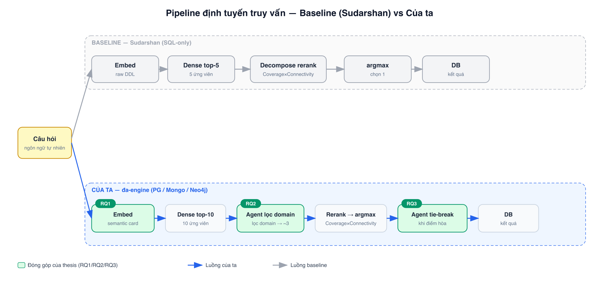
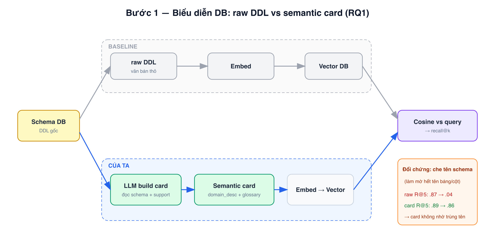
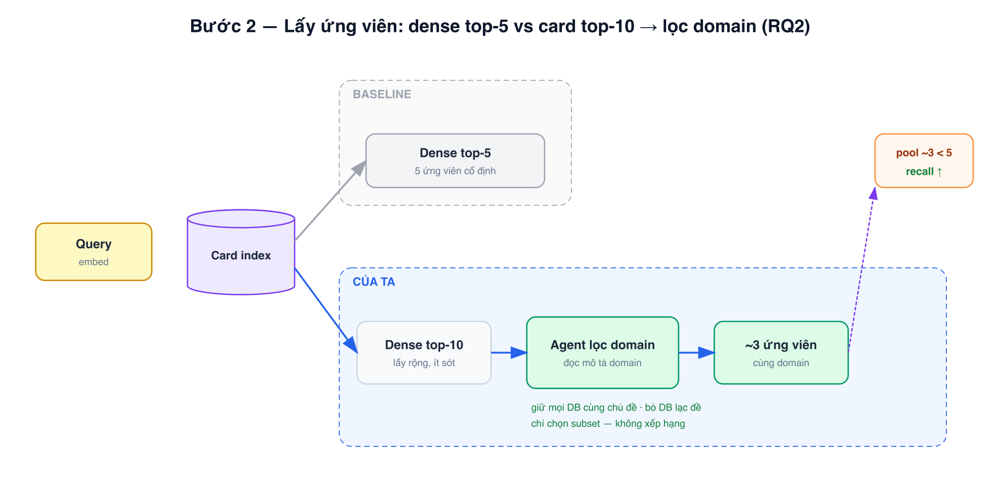
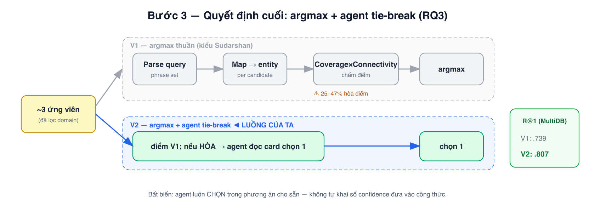

# Báo cáo benchmark định tuyến truy vấn đa cơ sở dữ liệu

**Ngày:** 2026-06-14 · **Embedder:** `text-embedding-3-large` (dùng chung mọi arm, chỉ khác phần văn bản được index) · **LLM:** `deepseek-v4-flash`.

---

## 1. Tổng quan

### 1.1 Bài toán và mục tiêu benchmark

Cho một câu hỏi ngôn ngữ tự nhiên và một repository gồm nhiều cơ sở dữ liệu thuộc nhiều loại engine (quan hệ / tài liệu / đồ thị), **định tuyến truy vấn** là chọn đúng một DB instance có thể trả lời câu hỏi đó. Benchmark này đo chất lượng định tuyến đó, và quan trọng hơn, dùng làm bằng chứng so sánh cách tiếp cận của thesis với SOTA hiện tại.

Việc định tuyến diễn ra theo hai bước nối tiếp, và ta **đo riêng từng bước** (không gộp thành một con số) để biết lỗi nằm ở đâu:

- **Lớp 1 — Retrieval (thu hẹp ứng viên):** từ toàn bộ repository, hệ thống lọc ra một nhóm nhỏ DB ứng viên. Câu hỏi cần đo: *DB đúng có lọt vào nhóm này không?* — tức chất lượng "không bỏ sót". Đo bằng **recall@k**: tỷ lệ câu hỏi mà DB đúng nằm trong top-k ứng viên.
- **Lớp 2 — Final routing (chọn 1):** từ nhóm ứng viên đó, hệ thống chốt đúng **một** DB để trả lời. Câu hỏi cần đo: *có chốt trúng DB đúng không?* Đo bằng **R@1**: tỷ lệ câu hỏi mà DB được chọn cuối cùng chính là DB đúng.

Phải tách vì một con số gộp sẽ che mất nguyên nhân: nếu lớp 1 đã bỏ sót DB đúng thì lớp 2 không thể cứu được; ngược lại, lớp 1 lấy đúng nhưng lớp 2 chọn sai lại là lỗi của bước quyết định. Trộn chung thì không biết phải sửa ở đâu.

### 1.2 Dữ liệu

Ba benchmark (chi tiết §2): **Spider-Route**, **Bird-Route** (tái dựng SOTA SQL-only để hiệu chuẩn baseline) và **MultiDB-Route** — benchmark đa-engine nguyên bản của thesis, gồm PostgreSQL + MongoDB + Neo4j, mở rộng từ Spider/BIRD (SQL), DocSpider/MongoDB-EAI (document), CypherBench/Text2Cypher (graph).

### 1.3 Câu hỏi nghiên cứu

- **RQ1 — Biểu diễn:** một *semantic card* (mô tả ngữ nghĩa do LLM sinh từ schema) có giúp retrieve DB đúng tốt hơn raw DDL không? Lợi thế đó có phải chỉ nhờ trùng tên schema không (kiểm bằng cách che tên schema + query đổi thuật ngữ)?
- **RQ2 — Pipeline retrieval:** lấy rộng (card top-10) rồi để agent *lọc domain* có cho nhóm ứng viên vừa **nhỏ hơn** vừa **recall cao hơn** dense top-5 của SOTA không?
- **RQ3 — Quyết định cuối:** ta giữ cơ chế decompose rerank + argmax của Sudarshan; trên nhóm ứng viên đã lọc, việc thêm **agent tie-break** khi điểm hòa có cải thiện định tuyến không? (đối chiếu thêm biến thể agent đọc toàn bộ card.)

### 1.4 Pipeline của ta so với baseline

| Stage | Baseline (Sudarshan, arXiv:2601.19825) | Ours |
|---|---|---|
| DB representation | raw DDL | **semantic card** (LLM from schema + support) |
| Candidate retrieval | dense embedding → top-5 | card embedding → top-10 → **agent lọc domain** → ~3 |
| Ranking / decision | decompose rerank (Coverage×Connectivity) → argmax | keep **decompose rerank → argmax**, add **agent tie-break** on ties |
| Engine scope | SQL-only | **multi-engine** (PG / Mongo / Neo4j) |

Ba khác biệt — biểu diễn (RQ1), thêm tầng lọc domain (RQ2), thêm agent tie-break ở bước quyết định (RQ3) — được tách riêng để đo từng đóng góp. Các phần §3–§5 dưới đây lần lượt trả lời RQ1, RQ2, RQ3.

---

## 2. Bộ benchmark

### 2.1 Phương pháp xây dựng

Theo phương pháp của Sudarshan [arXiv:2601.19825] cho bài toán định tuyến truy vấn: mỗi mẫu trong một dataset NL-to-Query gốc gồm (cơ sở dữ liệu, câu hỏi ngôn ngữ tự nhiên, truy vấn chuẩn). Ta gộp toàn bộ DB từ cả hai split gốc (train + test) thành một **repository hợp nhất** dùng chung khi suy luận; mục tiêu định tuyến là xác định đúng một DB ground-truth cho mỗi câu hỏi. Trong mỗi DB, tập câu hỏi được chia làm hai phần **rời nhau**: tập **support** (sinh semantic card — tương ứng split train của Sudarshan, nhưng hệ thống của ta không huấn luyện; support chỉ làm nguồn tư liệu mô tả, và mỗi DB chỉ đọc ≤5 câu khi sinh card) và tập **test** (đánh giá). Không câu hỏi nào nằm ở cả hai.

Ta dựng ba benchmark:

- **Spider-Route** và **Bird-Route** — tái dựng trung thực benchmark SQL-only của Sudarshan (mở rộng Spider [2] và BIRD-SQL [3]), dùng để (a) hiệu chuẩn baseline raw-DDL khớp số công bố, (b) so sánh trên cùng địa hình SQL.
- **MultiDB-Route** — benchmark đa-engine nguyên bản của thesis, mở rộng định tuyến từ SQL-only sang ba loại engine:
  - Quan hệ (PostgreSQL): Spider + BIRD.
  - Tài liệu (MongoDB): DocSpider (đã port) + MongoDB EAI native.
  - Đồ thị (Neo4j): CypherBench + Text2Cypher-2024.

### 2.2 Quy mô thật sự sử dụng

Mỗi benchmark là một **repository DB** dùng chung khi định tuyến. Hai khối câu hỏi được dùng, rời nhau: **support** — nguồn tư liệu sinh semantic card, mỗi DB chỉ đọc tối đa 5 câu; **eval slice** — lát cắt phân tầng để đánh giá (chi tiết cách lấy ở §2.3).

| Benchmark | Engine | #DB | Support đọc (card) | Eval slice | Dev slice |
|---|---|---|---|---|---|
| Spider-Route | PostgreSQL | 206 | ≤5 câu/DB (~1,0k) | 1,026 | 964 |
| Bird-Route | PostgreSQL | 80 | ≤5 câu/DB (~0,4k) | 1,026 | 974 |
| **MultiDB-Route (ours)** | PG / Mongo / Neo4j | **208** | ≤5 câu/DB (~1,0k) | **1,000** | 433 |

Phân bố engine của MultiDB-Route: PostgreSQL 94 DB · MongoDB 87 DB · Neo4j 27 DB.

### 2.3 Giao thức đánh giá (lát cắt đánh giá)

Tập test đầy đủ lớn và lệch theo độ phổ biến của từng DB (DB nhiều câu hỏi sẽ chi phối micro-recall). Để báo cáo **DB-macro** (mỗi DB trọng số bằng nhau) trung thực và chặn lệch, ta đánh giá trên một **lát cắt phân tầng** với mục tiêu **~1.000 câu/benchmark** — đủ lớn để khoảng tin cậy ổn định, đủ nhỏ để chạy nhanh, và mọi DB đều có mặt. Với mỗi DB ground-truth lấy tối đa *C* câu hỏi test (tất định, theo hoán vị seed cố định); *C* chọn sao cho tổng ≈ 1.000 (số DB khác nhau giữa các benchmark nên *C* khác nhau). Khối *C* câu kế tiếp mỗi DB là lát cắt **phát triển (dev)**, rời hẳn eval, chỉ dùng tinh chỉnh prompt.

| Benchmark | #DB | Cap/DB | Eval slice | Engine breakdown | Dev slice |
|---|---|---|---|---|---|
| **MultiDB-Route** | 208 | 8 | 1,000 | Mongo 516 · Neo4j 181 · PG 303 | 433 |
| Spider-Route | 206 | 5 | 1,026 | PG 1,026 | 964 |
| Bird-Route | 80 | 13 | 1,026 | PG 1,026 | 974 |

Dev của MultiDB-Route nhỏ hơn (433) vì nhiều DB thưa cạn câu hỏi sau khi trích đủ eval; dev chỉ phục vụ tinh chỉnh prompt nên kích thước không quan trọng bằng eval.

**Kiểm tra rò rỉ:** semantic card chỉ sinh từ tập support (rời tập test); giao support ∩ lát cắt đánh giá = 0 trên cả ba benchmark. Card dựng từ schema sạch (tư liệu build-time hợp lệ), không bao giờ từ câu hỏi test.

### 2.4 Metric + kiểm định

- **Recall@k** (lớp retrieval): micro = số hit / số câu hỏi; **DB-macro** = trung bình hit-rate theo từng DB ground-truth (metric headline cho MultiDB-Route). Hai số trùng nhau dưới lát cắt phân tầng cân bằng.
- **R@1 (chỉ trên câu có DB đúng trong pool)** (lớp final routing): chỉ tính trên câu hỏi mà DB đúng đã vào pool → tách lỗi retrieval khỏi lỗi quyết định.
- **Kiểm định:** McNemar exact two-sided binomial, theo cặp. Trường hợp trần (ceiling) gắn cờ rõ, không giấu.

---

## 3. Bước BIỂU DIỄN — raw DDL vs semantic card (RQ1)

**Ta khác baseline:** baseline embed thẳng raw DDL của DB; ta embed **semantic card** (mô tả ngữ nghĩa LLM sinh từ schema). Câu hỏi: card có retrieve tốt hơn không, và lợi thế có bền khi tên schema không còn trùng từ vựng với query không. Mọi so sánh dùng **cùng một embedder**, chỉ khác phần văn bản đưa vào index — nên chênh lệch là do biểu diễn, không phải do model embedding.

Lát cắt phân tầng ≤5 câu hỏi/DB.

### 3.1 So sánh recall raw vs semantic (đối đầu sạch)

| Set | Metric | raw | card | Δ | McNemar p |
|---|---|---|---|---|---|
| Spider-Route (206 DB, 1026 q) | R@1 | .614 | .644 | +.030 | .020 |
| | R@5 | .867 | .887 | +.019 | .036 |
| Bird-Route (80 DB, 398 q) | R@1 | .706 | .789 | +.083 | 3e-5 |
| | R@5 | .925 | .935 | +.010 | .50 (ceiling) |
| MultiDB-Route (208 DB, 743 q) | DB-macro R@1 | .566 | .613 | +.047 | .10 (borderline) |
| | DB-macro R@5 | .797 | .869 | +.072 | 8e-5 |

Card ≥ raw trên mọi tập/metric. Arm raw spider R@5 .867 ≈ Sudarshan công bố 87.0% → tái dựng baseline trung thực.

### 3.2 Card có chỉ thắng nhờ trùng tên không — tấn công phía câu hỏi

**Vì sao cần test:** §3.1 cho thấy card thắng raw, nhưng có một nghi ngờ: card thắng có thể chỉ vì nó chứa nhiều tên bảng/cột trùng với từ trong câu hỏi (khớp từ vựng đơn thuần), chứ không thật sự hiểu ngữ nghĩa. Test này phá nghi ngờ đó từ **phía câu hỏi**: làm cho từ trong câu hỏi KHÔNG còn trùng tên schema nữa, rồi xem card có còn thắng. Dùng hai benchmark đã qua bình duyệt:

- **Spider-Syn** — thay từ trong câu hỏi bằng từ đồng nghĩa (vd "film" thay "movie") nên không còn khớp tên cột.
- **Spider-Realistic** — bỏ hẳn việc nhắc tên cột một cách tường minh trong câu hỏi.

| Test set | Metric | raw | card | Δ | McNemar p |
|---|---|---|---|---|---|
| Spider-Syn | R@5 | .824 | .884 | +.060 | @1 p=1.4e-12 |
| Spider-Realistic | R@1 | .565 | .707 | +.142 | 8.7e-12 |

**Đọc:** câu hỏi càng ít trùng từ vựng với schema thì khoảng cách card − raw càng **rộng ra** (Spider-Realistic +.142). Lợi thế của card KHÔNG đến từ trùng tên — nó trụ vững đúng lúc sự trùng tên biến mất. Đây cũng là tình huống thực tế: người dùng hiếm khi gõ đúng tên cột.

### 3.3 Card có chỉ thắng nhờ trùng tên không — tấn công phía schema (đối chứng mạnh)

**Vì sao cần test:** đối chứng chặt hơn §3.2, tấn công từ **phía schema**. Ta **che (làm mờ) toàn bộ tên bảng/cột** — thay bằng token vô nghĩa, đồng nhất trên cả schema thô, card lẫn inventory; câu hỏi giữ nguyên. Dựng lại index và đo lại trên cùng lát cắt. Lập luận: nếu một biểu diễn chỉ thắng nhờ tên trùng câu hỏi, thì khi xóa sạch tên nó phải sụp.

| Set | Metric | raw (tên gốc) | raw (che tên) | card (tên gốc) | card (che tên) |
|---|---|---|---|---|---|
| Spider-Route | R@5 | .867 | **.043** | .887 | **.864** |
| Bird-Route | R@5 | .925 | **.123** | .935 | **.937** |
| MultiDB-Route | DB-macro R@5 | .797 | **.343** | .869 | **.836** |

**Đọc:** raw **sụp hẳn** khi che tên (Spider .867 → .043) — chứng tỏ raw DDL gần như chỉ sống nhờ tên bảng/cột trùng câu hỏi. Card **gần như không đổi** (.887 → .864) vì nó mã hóa ngữ nghĩa domain, không phụ thuộc tên. Chênh lệch card-che-tên vs raw-che-tên đều có ý nghĩa mạnh (p < 1e-10).

**Phạm vi claim (không nói quá):** test này chứng minh card độc lập tên ở **thời điểm truy vấn**. Card vẫn được xây từ schema sạch (còn tên) → KHÔNG phải claim "sạch tên từ đầu đến cuối".

---

## 4. Bước LẤY ỨNG VIÊN — dense top-5 vs card top-10 → lọc domain (RQ2)

**Ta khác baseline:** baseline lấy thẳng top-5 dense rồi đưa cả 5 xuống rerank. Ta lấy rộng hơn (top-10 để không bỏ sót DB đúng) rồi chèn một **tầng lọc domain**: agent đọc mô tả domain từng ứng viên, giữ mọi ứng viên cùng chủ đề và loại ứng viên rõ ràng lạc đề (chỉ chọn subset, không xếp hạng/không chọn winner — bước quyết định để dành lớp sau). Kỳ vọng: nhóm ứng viên vừa **nhỏ hơn** (rerank rẻ hơn) vừa **recall cao hơn** baseline.

Lát cắt phân tầng ≤5 câu hỏi/DB.

- **Cách A — raw top-5 (SOTA):** embed raw DDL, lấy thẳng top-5.
- **Cách B — card top-10 → lọc domain → top-K:** embed card lấy top-10, agent lọc domain (giữ mọi candidate cùng chủ đề, bỏ candidate rõ ràng lạc đề; chọn subset, không xếp hạng/không chọn winner → giữ invariant), trả về subset ~3.

| Set | Method | avg pool | micro R | DB-macro R | McNemar B vs A |
|---|---|---|---|---|---|
| MultiDB-Route (743 q) | raw top-5 (A) | 5.00 | .797 | .797 | — |
| | card top-10 | 10.0 | .917 | .925 | — |
| | **card10→lọc domain (B)** | **4.28** | **.902** | **.914** | 95 vs 17, **p<1e-4** |
| Spider-Route (1026 q) | raw top-5 (A) | 5.00 | .867 | .868 | — |
| | **card10→lọc domain (B)** | **4.27** | **.942** | **.942** | 91 vs 15, **p<1e-4** |
| Bird-Route (398 q) | raw top-5 (A) | 5.00 | .925 | .925 | — |
| | **card10→lọc domain (B)** | **2.69** | **.947** | **.948** | 14 vs 5, p=.064 (ceiling) |

**Bước lọc domain giữ được DB đúng bao nhiêu phần?** Tính trên những query mà DB đúng VỐN đã nằm trong top-10
(để tách lỗi bước lọc domain khỏi lỗi embedding — nếu embedding đã trượt thì không phải lỗi bước lọc domain): bước lọc domain giữ
lại MultiDB-Route 98.4%, spider 99.2%, bird 97.4%. Tức bước lọc domain vô tình bỏ DB đúng < 3%.

**Đọc:** cách B đạt recall ≥ raw top-5 ở pool NHỎ HƠN (2.7–4.3 vs 5). Tập đa-engine: +9.5 pp recall với ít candidate hơn, có ý nghĩa thống kê.

---

## 5. Bước XẾP HẠNG + QUYẾT ĐỊNH cuối (RQ3)

**Ta khác baseline:** baseline chấm điểm deterministic Coverage×Connectivity cho mỗi ứng viên rồi argmax. **Luồng của ta giữ nguyên decompose rerank + argmax đó, và thêm một agent tie-break khi điểm hòa (V2)** — đây là điểm khác duy nhất ở bước quyết định. Ta so hai mức để cô lập đóng góp của tie-break: V1 = argmax thuần không tie-break (đúng kiểu Sudarshan), V2 = luồng của ta (argmax + agent tie-break). Cả hai chạy trên cùng nhóm ứng viên + cùng phrase parse. Bất biến giữ nguyên: agent luôn *chọn* trong các phương án cho sẵn, không bao giờ tự khai một con số confidence rồi đưa vào công thức.

Probe 100 câu hỏi/benchmark (DIRECTIONAL — chưa phải headline). Đo trên pool đã lọc domain (~3 candidate cùng domain). Cùng pool + cùng phrase parse cho cả hai biến thể.

**Số đo = R@1 nhưng chỉ tính trên những query mà DB đúng đã nằm trong pool sau bước lọc domain** (tách lỗi bước quyết định khỏi lỗi retrieval — nếu DB đúng đã bị loại trước đó thì không phải lỗi của bước quyết định). Cột "số q hợp lệ" = số query thỏa điều kiện đó.

- **V1 — argmax thuần (kiểu Sudarshan):** parse query → phrase set → map phrase vào entity từng candidate → coverage = e^(−n·x) (x = tỷ lệ phrase không map được) → connectivity = BFS trên adjacency theo engine → score = Coverage×Connectivity → argmax. Không có tie-break.
- **V2 — argmax + agent tie-break (luồng của ta):** V1, nhưng khi điểm HÒA thì agent đọc card đầy đủ các candidate hòa + tiêu chí có thứ tự (domain → entities → relationships) chọn 1.

**Connectivity tính đúng theo định nghĩa gốc Sudarshan (chốt 2026-06-18):** mỗi phrase có thể map vào nhiều entity → connectivity = 1 nếu **tồn tại một tổ hợp** (một entity mỗi phrase) liên thông, KHÔNG phải gộp hết mọi candidate rồi đòi tất cả liên thông. Bản gộp-hết trước đó chặt hơn paper, giết DB đúng khi một phrase đa-nghĩa trải ở các bảng rời; sửa về faithful nâng V2 cả ba bộ (xem dưới) mà không thêm lời gọi LLM nào.

| Set (số q hợp lệ) | % hòa | avg hòa | V1 (argmax thuần) | **V2 (ours)** |
|---|---|---|---|---|
| MultiDB-Route (670 q) | 48% | 3.48 | 0.761 | **0.803** |
| Spider-Route (942 q) | 48% | 3.87 | 0.766 | **0.814** |
| Bird-Route (377 q) | 28% | 3.01 | 0.902 | **0.899** |

R@1 trên toàn bộ query (gồm cả query bị bước lọc domain bỏ DB đúng): MultiDB-Route .686/.724, Spider-Route .722/.767, Bird-Route .854/.852.

**Đọc:** Coverage×Connectivity bão hòa sau bước lọc domain: 28–48% query bị HÒA điểm (pool đã toàn cùng domain → tín hiệu phân biệt duy nhất của coverage là phrase-không-map-được hiếm khi kích hoạt). Chính các ca hòa đó là nơi **agent tie-break (V2)** can thiệp và nâng V1 → V2 trên hai bộ đa-nhập-nhằng (MultiDB +4,2đ, Spider +4,8đ); trên Bird (ít hòa, 28%) V1≈V2. Gain hướng dương nhưng chưa đạt mức có ý nghĩa per-set (McNemar MultiDB p=0,07) — phần residual là **nhập nhằng DB gần-trùng ở tie-break** (nhiều instance cùng domain, mô tả/schema trùng lặp), không phải lỗi chấm điểm. Cơ chế vẫn deterministic + giữ bất biến (agent chỉ chọn, không tự khai confidence).

**Luồng của ta:** `query → card embed top-10 → lọc domain → ~3–4 candidate → decompose rerank (Coverage×Connectivity-faithful) → argmax → agent tie-break khi gần-điểm → 1 DB [V2]`.

---

## 6. Tốc độ thực đo (sau khi tắt thinking)

Đo 2026-06-14, `deepseek-v4-flash`, 64 workers song song, lát cắt MultiDB-Route test:

| Mode | Throughput | Note |
|---|---|---|
| **thinking OFF** (lọc domain/parse/map) | **67 call/s** (200-call batch) | same recall as thinking-on |
| **thinking ON** (agent tie-break only) | **~7 call/s** (~8.9 s/call, ~7× slower) | fires only on ties |

Probe 15 câu hỏi MultiDB-Route test: tỷ lệ giữ DB đúng OFF = ON = 11/15; thinking chỉ đổi kích thước pool (precision — bước sau lo), KHÔNG đổi recall. → tắt thinking toàn flow, chỉ bật ở bước quyết định cuối.

---

## 7. Dự phóng thời gian các benchmark còn lại

### 7.1 Số lời gọi LLM mỗi query (luồng của ta V2)

- Bước lấy top: lọc domain 1 call (OFF).
- Bước xếp hạng (parse + map): parse 1 (OFF) + map ~4 candidate (OFF) ≈ 5 call OFF.
- Bước quyết định: argmax (0 LLM) + agent tie-break **chỉ khi điểm hòa** (~40% query) ≈ 0,4 call ON.

→ ~6 call OFF + ~0,4 call ON / query.

### 7.2 Ước lượng (throughput OFF 67/s, ON 7/s)

Số query = lát cắt đánh giá ~1.000/benchmark (§2.3); intra-mongo/intra-neo4j là subset engine của MultiDB-Route.

| Benchmark | #query (eval slice) | OFF (6/q) | ON (0.4/q) | **Total** |
|---|---|---|---|---|
| **intra-neo4j** (Neo4j subset) | 181 | ~16 s | ~10 s | **~27 s** |
| **intra-mongo** (Mongo subset) | 516 | ~46 s | ~30 s | **~76 s (1.3 min)** |
| **MultiDB-Route** | 1,000 | ~90 s | ~57 s | **~147 s (2.5 min)** |
| Spider-Route (reference) | 1,026 | ~92 s | ~59 s | ~2.5 min |
| Bird-Route (reference) | 1,026 | ~92 s | ~59 s | ~2.5 min |

**Chỉ lớp retrieval (lọc domain, không quyết định)** — headline recall cả ba tập: ~3.052 call OFF / 67 ≈ **~1 phút** (cộng embedding, vài giây).

→ Toàn bộ suite còn lại (3 benchmark chính + tham chiếu SQL) chạy trong **~9 phút** compute. Nếu chỉ cần lớp retrieval thì ~1 phút.

### 7.3 So sánh thời gian với SOTA

| Step | SOTA (Sudarshan) | Ours |
|---|---|---|
| Retrieval | dense embedding, **0 LLM/query** → seconds | embedding + **1 LLM lọc domain/query** (OFF, ~15 ms effective) |
| Rerank | LLM decompose map **per-candidate top-5** = ~5 call/q | parse 1 + map ~4 (smaller pool) ≈ 5 call/q |
| Decision | argmax deterministic (0 LLM) | argmax + agent tie-break **on ties only** (~0.4 ON call/q) |

**Kết luận thời gian:** ở lớp retrieval ta tốn thêm 1 call lọc domain/query so với SOTA (không đáng kể, ~15 ms). Ở lớp rerank chi phí tương đương SOTA (cùng bậc ~5 call/q) nhưng ta chạy trên pool nhỏ hơn. Ở bước quyết định ta chỉ cộng agent tie-break khi điểm hòa (~0,4 call/q). Tổng wall-time cả hai cùng bậc (phút/nghìn-query); **điểm khác biệt là recall/accuracy chứ không phải tốc độ** — ta đắt hơn SOTA không đáng kể về thời gian nhưng hơn rõ về recall (§4) và R@1 (§5).

---

## 8. Benchmark còn phải chạy (protocol)

1. **Lớp retrieval headline trên lát cắt đánh giá** (1.000 / 1.026 / 1.026). Chạy lại đồng nhất với thinking-off. ~1 phút.
2. **intra-mongo:** chạy full flow (lọc domain → parse/map → argmax + tie-break) trên subset Mongo (516 q). ~1,3 phút.
3. **intra-neo4j:** full flow trên subset Neo4j (181 q). ~27 giây.
4. **MultiDB-Route:** full flow trên eval slice (1.000 q). ~2,5 phút.

Mọi lần chạy: lát cắt phân tầng mục tiêu ~1.000 câu, cap/DB theo §2.3, mọi DB ground-truth có mặt; báo DB-macro làm headline cho MultiDB-Route; giữ hai lớp tách biệt; chạy kiểm định McNemar trước mọi kết luận "tốt hơn".

---

## 9. Hạn chế

- §3–§4 đo trên lát cắt phân tầng ≤5 câu hỏi/DB; lát cắt đánh giá đầy đủ (§2.3) cho headline cuối chưa chạy lại (§8.1).
- §5 (V1/V2) đã chạy trên lát cắt đầy đủ (MultiDB 670 / Spider 942 / Bird 377 câu hợp lệ, connectivity-faithful); gain V1→V2 hướng dương nhưng chưa significant per-set (McNemar p: MultiDB .07, Spider .60, Bird .24) — cần mẫu lớn hơn hoặc gộp bộ để khẳng định.
- Việc che tên schema chứng minh độc lập tên ở query-time, KHÔNG phải proxy-free toàn trình (card xây từ schema sạch).
- Bước lọc domain rớt GT < 3% là trần trên cho mọi bước sau; phần lớn do query chứa danh từ riêng/thiếu nội dung + nhãn single-destination.
